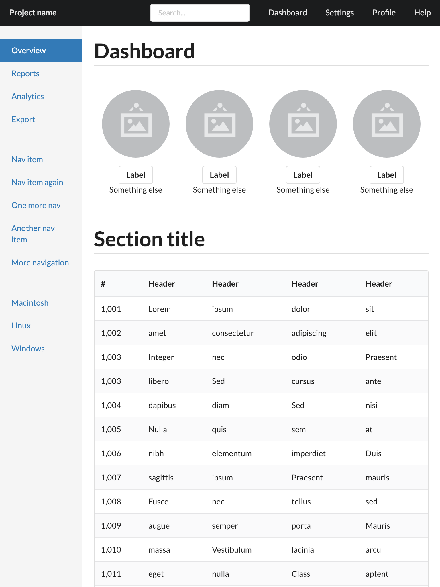

## Bootstrap/dashboard template

This is a demo template imported from
[Bootstrap](https://getbootstrap.com/docs/3.3/examples/dashboard/) to demonstrate
the power of [Semantic-UI](https://semantic-ui.com).

In includes two versions, one implemented in plain html, the other implemented
by [Semantic-UI-React](https://react.semantic-ui.com/).

Want to try yourself? Make sure that you have
[Node.js](https://nodejs.org/en/download/package-manager/) installed,
and better to get [Yarn](https://yarnpkg.com/) installed.

Besides, if you want to derive your work based on this template, I suggest you
to install the awesome [Browsersync](https://browsersync.io/) tool.

### HTML

```sh
git clone http://github.com/semantic-ui-forest/forest-templates
cd forest-templates/bootstrap/dashboard/html/
browser-sync start --server --files="**/*"
```

### React

```sh
git clone http://github.com/semantic-ui-forest/forest-templates
cd forest-templates/bootstrap/dashboard/react/
yarn # npm install
yarn start # npm start
```

### Screenshots

computer sized screen, 1440x900 for example:


tablet sized screen, 768x1024 for example:



mobile sized screen, 375x667 for example:


